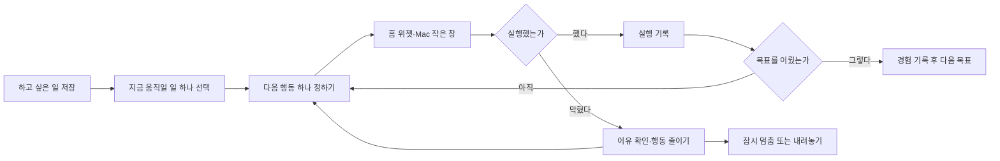

# 메멘토모리: 미루고 있는 삶

작성: 2026-09-26. 후속 기능의 상세 기획안. 기능 코드는 아직 구현하지 않았습니다.

## 1. 요약

메멘토모리는 삶의 유한함을 초 카운트다운으로 보여주고, 중요하지만 미루는 일을 실제 행동으로 연결합니다. 여러 인생 목표를 보관할 수 있지만 지금 실행할 목표는 하나, 그 목표의 다음 행동도 하나로 제한합니다. 실행·막힘·재조정·경험의 기록이 쌓이면 다음 선택에 도움을 주는지 검증합니다.

제품 약속: **언젠가 하려던 일을, 살아 있는 지금 하게 한다.**

카운트다운은 유입과 자각의 수단입니다. 후속 기능의 가치는 실제 시작과 지속적인 재조정으로 평가합니다. 목표 관리 서비스가 이미 존재하므로 기능의 신규성이나 고객가치가 입증됐다고 주장하지 않습니다.

## 2. 담당

| 역할 | 담당 | 책임 |
| --- | --- | --- |
| 제품 책임·첫 사용자 | 저장소 소유자 | 가치 판단, 실제 사용, 다음 범위 결정 |
| 기획·구현 | Codex | 공통 규칙, 플랫폼 구현, 검증, 변경 기록 |
| 외부 검증 참여자 | 모집 전 | 실제로 미룬 일과 행동 변화 확인 |

이번 문서의 결정은 구현 기본안입니다. 사용 흐름과 위젯 배치는 프로토타입 검증으로 다듬습니다.

## 3. 배경

iOS·Mac 카운트다운 MVP가 구현되어 있습니다. iOS는 SwiftUI와 WidgetKit, Mac은 SwiftUI와 AppKit 작은 창을 사용합니다. 공용 Swift 계산 코드와 설정 JSON, 플랫폼 공통 검증 데이터가 있습니다. 웹은 기존 기능과 디자인 미리보기를 유지하고 Android는 후순위입니다.

현재 MVP는 유한함을 느끼게 할 수 있지만 반복 사용과 실행에 주는 효과는 확인되지 않았습니다. 목표 등록·세부 과제·알림은 [iBucket](https://ibucket.app/help), 장기 목표와 실행 계획은 [GoalsOnTrack](https://www.goalsontrack.com/), 시간 제한을 둔 목표 실행은 [Day Zero](https://dayzeroproject.com/)에도 있습니다. 후속 기능의 차별성은 실제로 미뤄진 이유를 다루고 다시 시작하도록 돕는 경험에서 검증합니다.

## 4. 목적과 성공 기준

### 고객에게 제공할 변화

- 중요한 일 하나를 선택한다.
- 지금 실행할 수 있는 행동으로 줄인다.
- 자주 보는 화면에서 그 행동을 떠올린다.
- 하지 못했다면 이유를 확인하고 행동을 바꾼다.
- 실행 경험을 보관하고 다음 선택에 활용한다.

### 첫 개인 실험

본인이 14일 동안 사용합니다. 무료 iPhone 설치 만료에 맞춰 같은 bundle ID로 재설치하고, 만료 때문에 쓰지 못한 기간은 제품 리텐션과 구분합니다. 목표를 등록하고 실제 행동 하나를 시작했는지, 다음 행동을 스스로 정했는지, 재조정이 도움이 됐는지 일주일 간격으로 확인합니다. 본인의 만족은 외부 고객가치의 증거로 취급하지 않습니다.

### 이후 외부 탐색

조건에 맞는 10~15명의 2~3주 사용을 목표로 하되, 앱 배포 방법을 별도로 정한 뒤 진행합니다. 현재 Personal Team 설치를 다수 사용자 배포 수단으로 가정하지 않습니다. 그 전에는 5명 정도에게 인터뷰와 화면 프로토타입 사용을 진행할 수 있습니다.

다음 기준은 제안하는 탐색 지표이며 검증된 벤치마크가 아닙니다.

| 지표 | 정의 | 확인 방법 |
| --- | --- | --- |
| 시작 | 활성 목표와 다음 행동을 저장한 참여자 | 저장 데이터와 인터뷰 |
| 첫 실행 | 첫 행동 생성 후 7일 이내 완료 기록을 남긴 참여자 / 시작한 참여자 | 생성·완료 시각, 실제 행동 인터뷰 |
| 다음 행동 | 첫 실행 후 7일 이내 새 행동을 만든 참여자 / 첫 실행한 참여자 | 행동 이력 |
| 행동 리텐션 | 시작 후 8~14일 사이 실행·재조정·새 행동 중 하나가 있는 참여자 / 해당 기간을 관찰할 수 있었던 참여자 | 행동·돌아보기 이력 |
| 기록의 가치 | 이전 기록이 다음 선택에 도움이 된 구체적 사례 | 인터뷰 |
| 상시 표시 유지 | 홈 위젯 또는 Mac 작은 창을 유지하는지 | 참여자 확인; OS 노출 횟수를 측정하지 않음 |

수치를 보기 전에 참여자의 기존 문제와 관찰 가능 기간을 기록합니다. 완료 버튼만으로 실제 실행을 입증하지 않습니다. 외부 실험 전에는 진행 여부를 판단할 기준을 별도로 합의하고, 최초 실험에는 매출·유료 전환 목표를 넣지 않습니다.

## 5. 대상 고객

중요하고 실행 가능한 일인데 급하지 않다는 이유로 몇 달째 미루는 사람입니다. 첫 사례는 부모님과 여행 준비, 배우고 싶은 수업 알아보기, 개인 작품 공개, 연락하고 싶은 사람에게 연락하기 등입니다.

돈·건강·타인의 결정 때문에 지금 실행이 불가능한 일을 반드시 달성시키는 제품으로 약속하지 않습니다. 준비 행동을 고르거나 목표를 잠시 내려놓는 것도 유효한 결과입니다. 단기 업무 관리·팀 협업·운동 및 공부 습관 전체 관리는 첫 대상이 아닙니다.

## 6. 가치 제안

| 가치 | 첫 버전의 수단 | 검증해야 할 가정 |
| --- | --- | --- |
| 유한함 | 기존 초 카운트다운 | 익숙해진 뒤에도 의미가 남는가 |
| 동기 | 본인의 중요한 이유와 다음 행동 | 본인의 이유가 행동으로 연결되는가 |
| 반복 사용 | 막힌 이유 확인과 재조정 | 실패 이후에도 다시 도움을 받으러 오는가 |
| 누적 가치 | 목표·행동·경험을 연결한 기록 | 다음 선택에 기록이 도움이 되는가 |

목표의 개수·연속 달성·앱 체류시간을 늘리는 것을 제품 목적으로 삼지 않습니다. 목표를 놓아두거나 내려놓는 선택도 기록합니다. 내보내기를 제공하며, 누적 기록의 유용함으로 지속 사용을 얻습니다.

## 7. 해결 방식

### 7.1 화면과 사용 흐름

iOS의 주요 화면은 **지금 / 삶의 목록 / 기록**입니다. 모노톤과 Pretendard, 큰 카운트다운을 유지합니다. 작은 위젯의 숫자를 줄여 새 문구를 억지로 넣지 않습니다.

**지금:** 위쪽 카운트다운, 그 아래 활성 목표와 다음 행동, `실행했어요` / `다시 정할게요`. 활성 목표가 없으면 `지금 움직일 일 고르기`. 목표는 있지만 행동이 없으면 `다음 한 걸음 정하기`. 삶의 주간 달력과 기존 위젯 안내는 아래에 유지합니다.

**삶의 목록:** 지금 / 담아둔 일 / 잠시 멈춘 일 / 이룬 일 / 내려놓은 일. 첫 버전에 태그·폴더·검색·추천은 넣지 않습니다. 정렬은 활성 목표 먼저, 나머지는 최근 수정순입니다.

**목표 상세:** 제목, 중요한 이유, 현재 행동, 행동·돌아보기 이력. 제목과 이유는 수정할 수 있습니다. 목록 보관에는 제목만 필수이고, 활성화할 때는 이유 한 문장과 다음 행동을 필수로 받습니다.

**기록:** 실행·재조정·목표 완료·내려놓기의 날짜별 목록. 목표별로 들어가 이력을 볼 수 있습니다. 사진과 자동 요약은 후속입니다.

**목표 작성 예시:** `부모님과 여행 가기` / `함께 여행할 수 있을 때 추억을 만들고 싶어서` / `일요일에 가능한 날짜 물어보기`. 기존 생년월일 설정은 유지하며 목표 등록은 선택 사항입니다. 생년월일이 없어도 목표 기능을 사용할 수 있고 카운트다운 영역에는 시간 설정 안내를 표시합니다.

### 7.2 기능과 동작 규칙

| 기능 | 첫 버전 규칙 | 완료 기준 |
| --- | --- | --- |
| 목록 보관 | 여러 목표, 제목 필수 | 재실행 후 동일 목록 |
| 집중할 목표 | 활성 목표 최대 하나 | 다른 목표 선택 시 이전 목표를 잠시 멈춘다는 확인 |
| 다음 행동 | 목표별 대기 행동 최대 하나, 계획일 선택 가능 | 추상적 제목 대신 사용자가 실행할 동사를 작성하도록 예시 제공 |
| 실행 기록 | 행동 완료와 목표 완료를 별도로 처리 | 행동 완료만으로 목표가 완료되지 않음 |
| 재조정 | 이유 선택, 더 작은 행동·다른 날짜·일시 중단·내려놓기 | 이전 행동과 변경 이유가 이력에 남음 |
| 목표 완료 | 사용자 확인, 경험 한 문장 선택 입력 | 완료한 목표와 행동 이력 유지 |
| 주간 돌아보기 | 앱을 열면 조건에 맞는 카드 | 마지막 돌아보기/활성화/실행 중 가장 최근 시점에서 현지 달력 7일 후 노출 |
| 백업과 이동 | 목표 기록 전용 JSON | 명시적 확인 뒤 교체, 기존 설정 JSON은 유지 |

주간 돌아보기는 활성 목표가 있을 때만 표시합니다. 실행 직후 다시 묻지 않습니다. 기한이 지나도 실패·빨간 경고로 표시하지 않고 `계획한 날이 지났어요. 다시 정할까요?`를 사용합니다. 계획일은 실제 사망일이나 수명 계산에서 자동 생성하지 않습니다.

**막힌 이유:** 너무 막연함 / 시간 부족 / 돈·준비 필요 / 다른 사람과 조율 필요 / 우선순위 변경 / 다른 이유. 이유에 따라 작성 도움말을 바꾸되 행동은 사용자가 정합니다. AI 자동 계획은 넣지 않습니다. 막힌 이유만 남기고 기존 행동을 유지하는 `그대로 이어가기`도 지원합니다.

**목표 상태:** `planned`(담아둠), `active`(지금), `paused`(잠시 멈춤), `completed`(이룸), `released`(내려놓음). completed/released 목표를 다시 시작하면 이전 종료 기록을 보존하고 새 행동을 만듭니다.

**행동 상태:** `pending`, `completed`, `adjusted`, `cancelled`. 새 행동으로 바꾸면 기존 pending을 adjusted로 닫고 새 pending을 하나 만듭니다. 잠시 멈출 때는 기존 pending을 유지하여 재개할 수 있습니다. 목표 완료·내려놓기 때 남은 pending은 cancelled로 닫고 완료했다고 기록하지 않습니다. 실행 완료는 중복 탭으로 중복 기록되지 않습니다.

**삭제:** 목표와 연결 기록의 영구 삭제는 별도 확인 후 수행합니다. 시간 설정 초기화는 목표를 지우지 않고, 목표 기록 초기화도 생년월일·창 위치·테마를 지우지 않습니다. 기존 `기록 지우기` 문구는 범위를 분명히 설명하도록 변경합니다.

### 7.3 위젯과 Mac 작은 창

| 표시 면 | 목표가 있을 때 | 목표가 없을 때 |
| --- | --- | --- |
| iOS 중간 홈 위젯 | 기존 문장 자리에 다음 행동 한 줄, 탭하면 해당 목표 | 기존 오늘의 문장·기본 문구 |
| iOS 작은 홈 위젯 | 두 줄 총 초와 여백 유지, 탭하면 해당 목표 | 기존 디자인과 기본 진입 |
| iOS 잠금화면 | 기존 숫자·비율 유지, 탭하면 활성 목표 | 기존 진입 |
| Mac 가로형·충분한 높이 | 기존 문장 자리에 다음 행동, 명시적 버튼으로 관리 창 | 기존 문장 |
| Mac 정사각형·좁은 창 | 기존 숫자 유지, 메뉴에서 지금의 한 걸음 열기 | 기존 동작 |

이 버전의 위젯은 읽기와 화면 이동만 합니다. 위젯 안에서 완료 버튼을 실행하지 않습니다. 숫자·상하 여백을 유지하고 행동 문장은 말줄임이 가능하되 탭한 상세 화면에서 전문을 보여줍니다. iOS에서 개별 생년월일을 지정한 위젯은 현재 개인 목표를 섞지 않고 기존 문장을 유지합니다. 개인 목표는 앱 프로필을 따르는 위젯에만 표시합니다.

Mac 작은 창은 현재 키보드 입력을 받지 않는 NSPanel입니다. 목표 편집은 별도 일반 NSWindow에서 수행합니다. 위젯의 이동·크기 조절 영역과 목표 열기 버튼이 충돌하지 않아야 합니다.

위젯 이동은 [Apple의 widgetURL 방식](https://developer.apple.com/documentation/widgetkit/linking-to-specific-app-scenes-from-your-widget-or-live-activity)을 사용합니다. 갱신 요청은 OS 정책의 영향을 받으며 즉시 표시를 보장하지 않습니다.

### 7.4 데이터와 기술

공용 Swift package에 목표 모델·검증·상태 전환·파일 저장·표시용 요약을 추가합니다. iOS/Mac UI는 플랫폼 안에 둡니다. 새 프레임워크나 서버를 추가하지 않습니다.

기존 `SettingsFile`과 `settings.v1`은 바꾸지 않습니다. 목표는 별도의 `life-goals.v1.json` 계약과 파일로 관리합니다. 오래된 앱에서 설정을 가져왔다고 목표가 삭제되는 일을 피합니다. 두 플랫폼의 목표 기록은 독립적이며 수동 내보내기/가져오기로 이동합니다. 서로 다른 기록을 자동 병합하지 않습니다.

최소 데이터:

- `LifeGoal`: UUID, 제목, 이유, 상태, 생성·수정 시각, 첫 활성화 시각, 현재 종료 시각.
- `NextAction`: UUID, goalID, 문장, 계획일(선택), 상태, 생성·종료 시각, 대체한 이전 행동 ID(선택), 생성 당시 목표 제목·이유.
- `GoalReview`: UUID, goalID, actionID(선택), 종류(execution/adjustment/pause/resume/completion/release/checkin), 막힌 이유(선택), 기록 한 문장(선택), 기록 시각, 당시 목표 제목·이유·행동 문장.
- `GoalWorkspace`: 위 세 목록. 활성 목표는 상태에서 계산하여 중복된 포인터를 저장하지 않습니다.
- `GoalsFile`: app=`mementomori`, kind=`life-goals`, version=1, workspace.
- `GoalWidgetSummary`: 활성 goalID·actionID·행동 문장·계획일·작성 시각만 있는 읽기용 캐시.

시각은 ISO 8601 UTC, 계획일은 `YYYY-MM-DD` 현지 달력 날짜입니다. ID 중복·잘못된 참조·동시 활성 목표·중복 pending 행동·지원하지 않는 버전은 가져오기에서 거부합니다. completed/released에는 종료 시각이 필요합니다. 비활성 목표에서 pending을 completed로 바꾸려면 먼저 목표를 재개합니다.

입력 한도는 제목 100, 이유 300, 행동 100, 돌아보기 500 UTF-16 코드 단위입니다. 제목·행동은 공백만으로 저장할 수 없습니다. 계획일은 실제 달력 날짜이며 미래의 종료 시각이나 수명 기반 날짜를 자동 입력하지 않습니다. 파일은 5MiB, 각 목록은 10,000개 레코드 이하로 읽습니다. 한도 초과 시 기존 데이터를 유지하고 오류를 보여줍니다.

저장소는 앱의 Application Support 안의 원자적 JSON 파일입니다. 저장 성공 후에만 화면 상태를 바꿉니다. 직전 유효본을 백업하며 손상 파일·알 수 없는 버전은 자동으로 빈 데이터로 덮어쓰지 않습니다. 복구 여부를 안내하고 유효 백업 복원 또는 사용자 파일 가져오기를 제공합니다. 복구로 파일을 교체할 때는 원본 바이트를 recovery 파일에 보존합니다. 인코딩한 새 파일도 같은 5MiB 제한을 적용해 저장한 파일을 다시 읽지 못하는 상태를 방지합니다. 해당 위치의 선택은 [Apple 파일 저장 지침](https://developer.apple.com/documentation/foundation/using-the-file-system-effectively)을 따릅니다.

iOS는 저장한 뒤 App Group에 표시 요약만 쓰고 timeline 갱신을 요청합니다. 전체 이력은 위젯에 복제하지 않습니다. 요약 저장 실패 시 원본 저장을 되돌리지 않고 안내한 뒤 앱을 다시 활성화할 때 재시도합니다. 위젯은 데이터를 수정하지 않습니다. 오래된 링크·삭제된 목표는 오류 화면 대신 현재 목록으로 이동합니다.

실험 지표는 행동/돌아보기 시각과 참여자 인터뷰로 확인합니다. 외부 분석 SDK·자동 위젯 노출 측정·일별 사용 감시는 첫 버전에 넣지 않습니다. 사용자의 실제 데이터는 테스트 fixture에 넣지 않습니다.

### 7.5 가정과 위험

- 한 목표 집중이 선택 부담을 줄이는지는 미확인입니다. 목표를 저장할 때 곧바로 활성화하도록 강요하지 않습니다.
- 수동 회고가 귀찮을 수 있습니다. 이유 선택은 짧게 하고 자유 서술은 선택 사항으로 둡니다.
- 카운트다운이 행동을 더 돕는지 확인하지 못했습니다. 동일한 행동 흐름의 카운트다운 유무 비교를 외부 실험에서 검토합니다.
- 기기 간 동기화 부재는 불편할 수 있습니다. 첫 실험에서는 주 사용 기기를 정하고 양쪽에서 동시에 편집하지 않습니다.
- 개인 기록의 누적 가치는 긴 관찰이 필요합니다. 14일 실험만으로 락인이 입증됐다고 판단하지 않습니다.

## 8. 출시와 구현 범위

순서는 공통 규칙·저장 → iOS 행동 흐름 → 위젯 연결 → Mac 관리 창 → 백업·복구·통합 검증 → 개인 사용입니다. 각 단계는 완성 기준을 통과한 뒤 다음으로 이동합니다. 상용 배포와 Android 구현은 포함하지 않습니다.

첫 버전: 여러 목표 보관, 한 목표 집중, 다음 행동, 실행·막힘·재조정, 짧은 기록, 주간 돌아보기, 위젯 이동, 백업과 수동 이동.

후속 판단: 사진·월간 회고·관계 중심 기능·선택적 알림·기기 간 동기화. 실제 반복 요청과 사용 결과를 보고 선택합니다. AI 코치, 소셜 피드, 공유 경쟁, 스트릭, 결제, 목표별 사망 카운트다운은 첫 범위에 넣지 않습니다.

구현 작업과 검증 순서는 [구현 계획](IMPLEMENTATION-life-goals.md)을 따릅니다. 현재 플랫폼 지원 현황은 [PLATFORMS.md](PLATFORMS.md)를 따르며, 이 문서의 기능은 완료 전까지 현황 표에 추가하지 않습니다.
